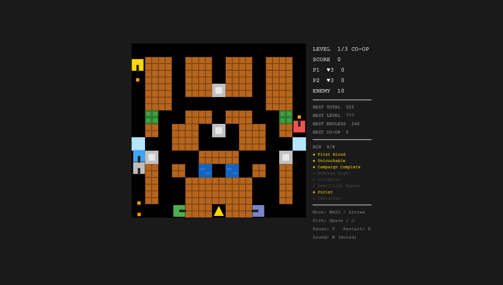

# Tank World 🛡️

经典坦克大战（Battle City 风格）——**26KB 单文件、零运行时依赖**的浏览器游戏。

**▶ 在线游玩：** https://corray.github.io/tank-world/ （或下载 `dist/index.html` 双击即玩）



## 玩法

- **3 关战役** + 全通后**无尽模式**（难度无限递增）
- **本地双人合作**：标题画面按 `2`（P1: WASD+J / P2: 方向键+Enter）
- 6 种地形：砖墙（1/4 子块破坏）/ 钢墙 / 草丛（隐身）/ 河流 / 冰面（惯性滑行）/ 基地
- 3 种道具（护盾/双发/炸弹）、3 类敌人 AI、8 个成就、四档最高分

| 按键 | 功能 |
|------|------|
| WASD / 方向键 | 移动（单人模式双绑定） |
| Space / J | 开火 |
| P / R / M / 2 | 暂停 / 重开 / 静音 / 双人 |

## 技术

TypeScript + 裸 Canvas 2D + Vite（singlefile）+ Vitest。全量单元测试 + CI 门禁 + 自动部署（实时数字见 CI 徽标与 tests/）。

```bash
npm ci && npm run dev    # 开发
npm run build            # 构建单文件 dist/index.html
npx vitest run           # 测试
```

## 工作流声明

本项目是 **agent-dev-standard** AI 协作工作流的公开实验场：五轮迭代全部经由「PRD → 共识文档 → 设计门禁（G1~G3）→ 测试骨架锁定（G4）→ 实现 → 验收 → PR」流程交付，全程留痕可审计。

- 全链路 spec 文档：[`docs/spec/`](docs/spec/)（共识 v5 / 数据模型 34 节 / 5 份测试计划执行记录）
- 决策与问题留痕：[`docs/prd/`](docs/prd/) / [`docs/problems/`](docs/problems/) / [`docs/adr/`](docs/adr/)
